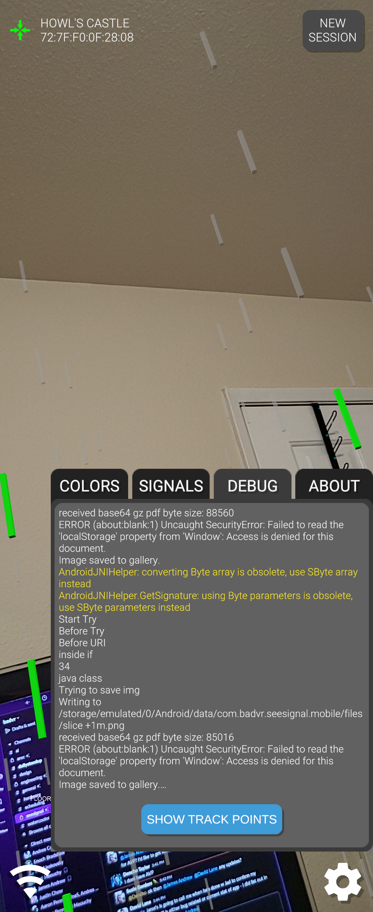

<em>SeeSignal</em> is a mixed reality app from BadVR that visualizes wireless signals (WiFi, Bluetooth, cellular) as interactive holograms in your environment, letting you literally “see” network strength, dead zones, and signal interactions.
 

  
  <video muted autoplay="" name="media" loop="">  
    <source src="https://raw.githack.com/Denchyaknow/GitSite_Dencho/Develop/assets/media/projects/SeeSignal/SeeSignal_Bug_0.webm" type="video/mp4">  
  </video>  

<!--more--> 

I worked on SeeSignal in a hands-on capacity: implementing core features, issuing patches, and supervising both the **Meta (Quest)** and **Android** builds for major release versions. My role included build orchestration, feature stabilization across platforms, and ensuring platform compliance and performance.

One major challenge was keeping the signal sampling and rendering in sync across platforms. On the Quest, you have constraints of passthrough, GPU budget, and frame rates. On Android (for AR-capable phones/tablets), you must adapt to variable sensor latency, camera stabilization, and signal noise from the hardware itself. In the end once we got our tools working on Android porting to the MetaQuest was straight forward.

  
  <video muted autoplay="" name="media" loop="">  
    <source src="https://raw.githack.com/Denchyaknow/GitSite_Dencho/Develop/assets/media/projects/SeeSignal/SeeSignal_Bug_1.webm" type="video/mp4">  
  </video>  

The majority of my work in Seesignal involved bug and performance patches. As developers implimented features, I would optimize where I coult to make sure we hit the target framerate required for XR.

  
  <video muted autoplay="" name="media" loop="">  
    <source src="https://raw.githack.com/Denchyaknow/GitSite_Dencho/Develop/assets/media/projects/SeeSignal/SeeSignal_Bug_2.webm" type="video/mp4">  
  </video>  

Because SeeSignal overlays real-world signal data, calibration and spatial mapping were critical. I added fallback heuristics and smoothing filters to avoid jitter or ghost signals when hardware sensors momentarily failed or reported noisy values.

Though I can’t share all proprietary details, working on SeeSignal was a major piece of my XR portfolio, it pushed me to solve real problems at the intersection of hardware, spatial computing, and user experience.

